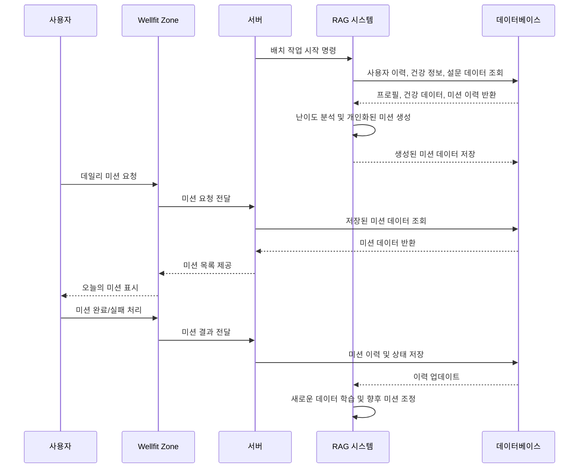
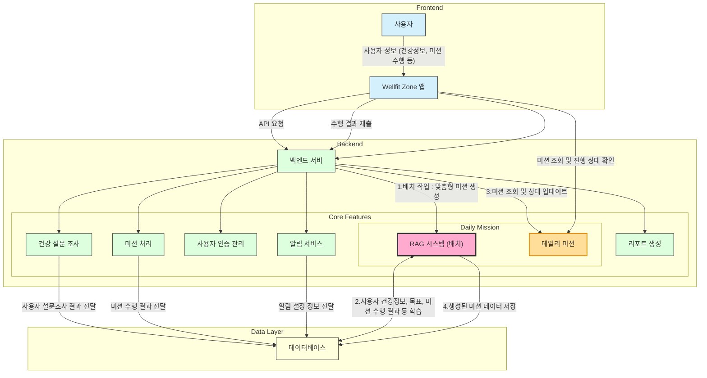

## 🙌 Wellfit Zone
"AI와 함께하는 당신만의 맞춤형 웰니스 여정”  
(보안서약서로 인해 소스코드를 보여드리지 못하는 점 양해 부탁드립니다.)

### 프로젝트 개요
Wellfit Zone은 사용자의 생활 패턴과 건강 데이터를 바탕으로 개인 맞춤형 웰니스 미션을 제공하는 혁신적인 AI 헬스케어 플랫폼입니다.  
RAG 시스템(Retrieval-Augmented Generation)을 통해 매일의 일상 속에서 실행 가능한 미션을 자동 생성하여 지속적인 건강 관리를 지원합니다. 
운동, 수면, 식습관, 스트레스 관리 등 전반적인 건강 루틴을 통합해 사용자의 전반적인 웰빙을 향상합니다.

### 주요기능
1. **RAG 기반 맞춤형 미션 생성**
   - 사용자 데이터에 따라 매일 적합한 미션을 제안해 지속적인 건강 관리와 성취감을 높여줍니다.
   - 사용자의 건강 상태와 목표 달성도를 고려해 일상에 자연스럽게 녹아드는 미션을 제공합니다.
2. **개인화된 목표 및 난이도 조정**
   - 건강 상태와 성과에 따라 난이도가 자동 조정되어 누구나 부담 없이 참여할 수 있습니다.
   - 운동, 식습관, 수면, 스트레스 관리 등의 목표를 사용자 취향과 필요에 맞게 설정할 수 있습니다.
3. **실시간 피드백과 보상 시스템**
   - 미션 성공 시 포인트와 보상이 제공되어, 꾸준한 동기 부여로 건강한 습관 형성을 돕습니다.  
4. **데이터 기반 헬스 리포트 제공**
   - 주간, 월간 단위의 건강 데이터 리포트로 상태를 시각적으로 파악하고, 축적된 데이터를 바탕으로 개인화된 추천을 제공합니다.

### Parsing 시퀀스 다이어그램

### Chunking 시퀀스 다이어그램

### Vector Embedding 시퀀스 다이어그램

### Retrieving 시퀀스 다이어그램

### Prompt 시퀀스 다이어그램

### WellfitZone 시퀀스 다이어그램

---
### WellfitZone 시퀀스 아키텍쳐 (데일리미션 강조)

### WellfitZone RAG 활용 DB ERD

```mermaid
erDiagram
    %% 사용자 기본 정보 테이블
    tb_user_m {
        INT user_id PK "사용자 고유 ID"
        VARCHAR name "사용자 이름"
        VARCHAR password "암호화된 비밀번호"
        VARCHAR email "이메일 주소"
        VARCHAR phone_number "전화번호"
        DATE birthdate "생년월일"
        VARCHAR gender "성별 (공통 코드 참조)"
        VARCHAR profile_picture "프로필 사진 URL"
        TIMESTAMP created_at "계정 생성 시각"
        TIMESTAMP updated_at "업데이트 시각"
    }

    %% 사용자 상세 정보 테이블
    tb_user_d {
        INT user_id PK "사용자 고유 ID"
        INT age "나이"
        FLOAT weight "체중"
        FLOAT height "키"
        INT exercise_id FK "운동 응답 ID"
        INT eating_id FK "식습관 응답 ID"
        INT stress_id FK "스트레스 응답 ID"
        INT sleep_id FK "수면 응답 ID"
        INT goal_id FK "목표 응답 ID"
        INT noti_id FK "알림 설정 ID"
        VARCHAR smoking_status "흡연 여부"
        VARCHAR drinking_habits "음주 습관"
        TIMESTAMP created_at "생성 시각"
        TIMESTAMP updated_at "업데이트 시각"
    }

    %% 설문조사 테이블
    tb_surveys_m {
        INT survey_id PK "설문조사 ID"
        VARCHAR survey_category "설문조사 유형 (공통 코드 참조)"
        VARCHAR description "설문조사 설명"
        TIMESTAMP created_at "생성 시각"
        TIMESTAMP updated_at "업데이트 시각"
    }

    %% 설문조사 질문 테이블
    tb_survey_questions_m {
        INT question_id PK "질문 ID"
        INT survey_id FK "설문조사 ID"
        TEXT question_text "질문 내용"
        VARCHAR question_type "질문 유형 (공통 코드 참조)"
        TEXT question_options "질문 옵션"
        TIMESTAMP created_at "생성 시각"
        TIMESTAMP updated_at "업데이트 시각"
    }

    %% 운동 설문 응답 테이블
    tb_exercise_d {
        INT exercise_id PK "운동 응답 ID"
        INT user_id FK "사용자 ID"
        INT survey_id FK "설문조사 ID"
        INT question_id FK "질문 ID"
        VARCHAR answer "응답 내용"
        VARCHAR additional_answer "기타 응답"
        TIMESTAMP created_at "응답 생성 시각"
        TIMESTAMP updated_at "업데이트 시각"
    }

    %% 식습관 설문 응답 테이블
    tb_eating_d {
        INT eating_id PK "식습관 응답 ID"
        INT user_id FK "사용자 ID"
        INT survey_id FK "설문조사 ID"
        INT question_id FK "질문 ID"
        VARCHAR answer "응답 내용"
        VARCHAR additional_answer "기타 응답"
        TIMESTAMP created_at "응답 생성 시각"
        TIMESTAMP updated_at "업데이트 시각"
    }

    %% 스트레스 설문 응답 테이블
    tb_stress_d {
        INT stress_id PK "스트레스 응답 ID"
        INT user_id FK "사용자 ID"
        INT survey_id FK "설문조사 ID"
        INT question_id FK "질문 ID"
        VARCHAR answer "응답 내용"
        VARCHAR additional_answer "기타 응답"
        TIMESTAMP created_at "응답 생성 시각"
        TIMESTAMP updated_at "업데이트 시각"
    }

    %% 수면 설문 응답 테이블
    tb_sleep_d {
        INT sleep_id PK "수면 응답 ID"
        INT user_id FK "사용자 ID"
        INT survey_id FK "설문조사 ID"
        INT question_id FK "질문 ID"
        VARCHAR answer "응답 내용"
        VARCHAR additional_answer "기타 응답"
        TIMESTAMP created_at "응답 생성 시각"
        TIMESTAMP updated_at "업데이트 시각"
    }

    %% 목표 설문 응답 테이블
    tb_goal_d {
        INT goal_id PK "목표 응답 ID"
        INT user_id FK "사용자 ID"
        INT survey_id FK "설문조사 ID"
        INT question_id FK "질문 ID"
        VARCHAR answer "응답 내용"
        VARCHAR additional_answer "기타 응답"
        TIMESTAMP created_at "응답 생성 시각"
        TIMESTAMP updated_at "업데이트 시각"
    }

    %% 미션 테이블
    tb_missions_m {
        INT mission_id PK "미션 ID"
        INT mission_score_id FK "미션 점수 ID"
        VARCHAR mission_info "미션 설명"
        VARCHAR mission_info_text "텍스트 미션 설명"
        VARCHAR mission_info_image "이미지 미션 설명"
        TIMESTAMP created_at "생성 시각"
        TIMESTAMP updated_at "업데이트 시각"
    }

    %% 미션 점수 테이블
    tb_mission_score {
        INT mission_score_id PK "미션 점수 ID"
        VARCHAR mission_score_type "미션 유형"
        VARCHAR mission_score_level "난이도"
        FLOAT mission_score_base "기본 점수"
        FLOAT mission_score_text "텍스트 제출 추가 점수"
        FLOAT mission_score_image "이미지 제출 추가 점수"
        TIMESTAMP created_at "생성 시각"
        TIMESTAMP updated_at "업데이트 시각"
    }

    %% 공통 코드 테이블
    tb_common_code_m {
        INT code_id PK "코드 ID"
        VARCHAR code_type "코드 유형"
        VARCHAR code_value "코드 값"
        VARCHAR code_description "코드 설명"
        INT order_no "순서 번호"
        BOOLEAN use_yn "사용 여부"
        TIMESTAMP created_at "생성 시각"
        TIMESTAMP updated_at "업데이트 시각"
    }

    %% 관계 정의
    tb_user_m ||--o{ tb_user_d : "1:1 관계"
    tb_user_m ||--o{ tb_exercise_d : "1:N 관계"
    tb_user_m ||--o{ tb_eating_d : "1:N 관계"
    tb_user_m ||--o{ tb_stress_d : "1:N 관계"
    tb_user_m ||--o{ tb_sleep_d : "1:N 관계"
    tb_user_m ||--o{ tb_goal_d : "1:N 관계"
    tb_surveys_m ||--o{ tb_survey_questions_m : "1:N 관계"
    tb_surveys_m ||--o{ tb_exercise_d : "1:N 관계"
    tb_surveys_m ||--o{ tb_eating_d : "1:N 관계"
    tb_surveys_m ||--o{ tb_stress_d : "1:N 관계"
    tb_surveys_m ||--o{ tb_sleep_d : "1:N 관계"
    tb_surveys_m ||--o{ tb_goal_d : "1:N 관계"
    tb_missions_m ||--o{ tb_mission_score : "1:N 관계"
    tb_missions_m ||--o{ tb_user_missions_h : "1:N 관계"
    tb_common_code_m ||--o{ tb_exercise_d : "1:N 관계 (공통 코드 참조)"
    tb_common_code_m ||--o{ tb_mission_score : "1:N 관계 (난이도)"
```

ERD 주소
- https://dbdiagram.io/d/RAG_ERD-67226db92c337ee119ec22a8

**저작권(Copyright) 공지**  
본 문서의 내용은 저작권법에 의해 보호되며, **Wellfit Zone** 프로젝트 관련 정보로서 오직 정보 제공과 공유 목적을 위해 작성되었습니다.
문서의 모든 내용은 **Momegrowth** 및 관련 저작권자의 허락 없이 복사, 배포, 수정할 수 없습니다. 본 자료를 인용하거나 사용하고자 할 경우 사전 허락을 요청하시기 바랍니다.  
**© 2024 Momegrowth. All rights reserved.**
